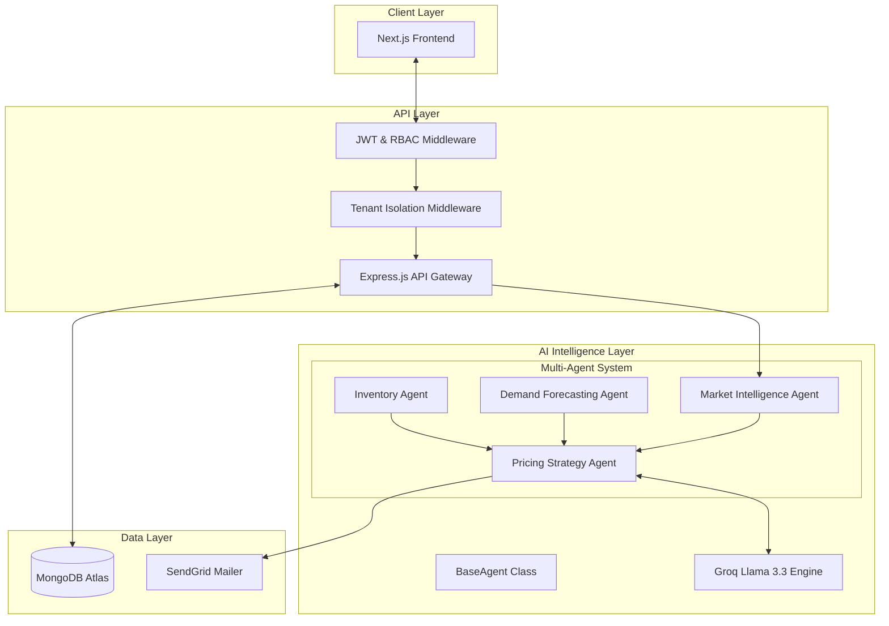
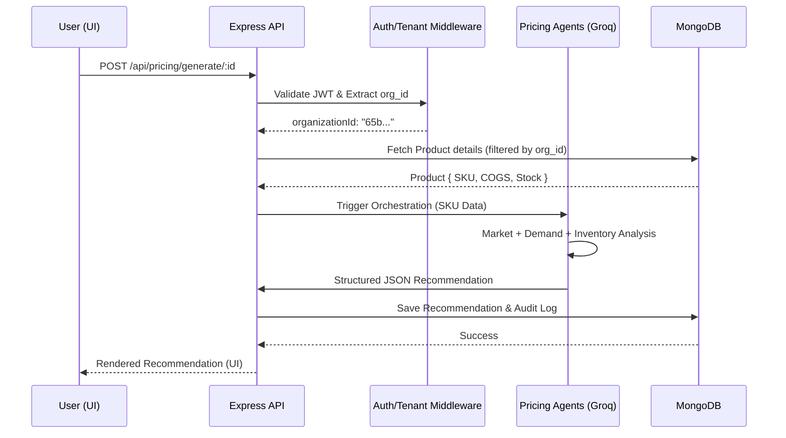
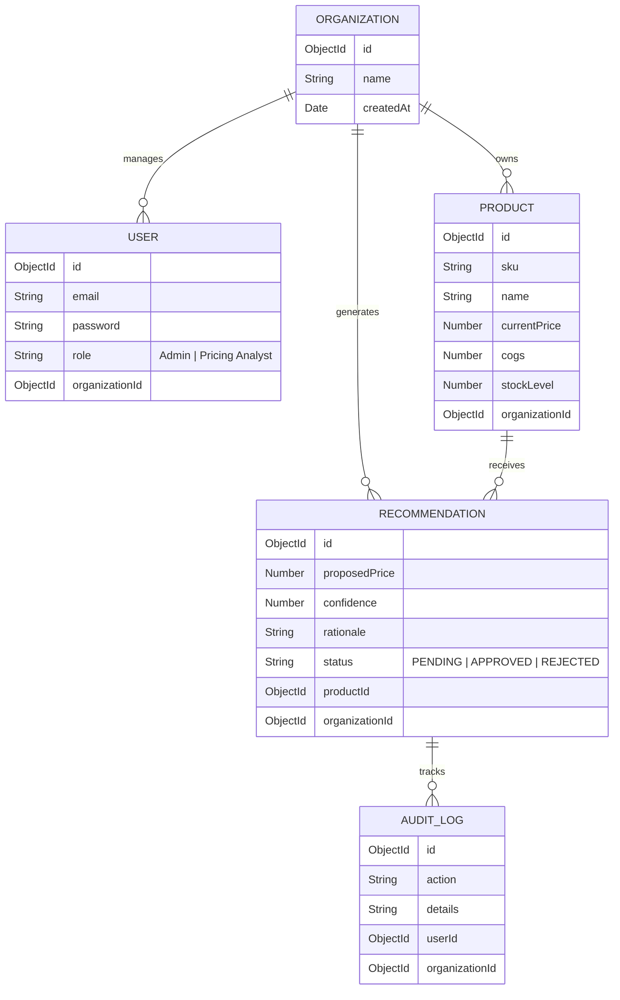
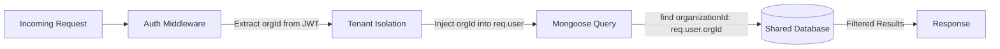

# System Architecture: AI-Powered Dynamic Pricing Engine

This document outlines the technical architecture, data flow, and design patterns used in the AI-Powered Dynamic Pricing Engine.

## 1. System Architecture Diagram
The system follows a modern decoupled architecture with a focus on security, scalability, and AI orchestration.

---

## 2. Data Flow Diagram
Tracing a user's request from input to persistent output.

---

## 3. Database Schema (ER Diagram)
The system uses a document-oriented model optimized for multi-tenancy.

---

## 4. AI Orchestration Flow (Option B: Multi-Agent)
The orchestration is handled through a sequential agentic flow where a "Strategist" synthesizes inputs from specialized "Specialists".

1.  **Context Assembly**: The `PricingStrategyAgent` gathers raw data from the `MarketIntelligenceAgent` (competitors) and `InventoryAgent` (stock levels).
2.  **Specialist Prompts**: Each specialist agent generates a domain-specific analysis using the Groq Llama 3.3 engine.
3.  **Synthesis**: The strategy agent receives these outputs and performs a "Chain of Thought" reasoning to calculate the final `proposedPrice`.
4.  **Structured Output**: The LLM uses **JSON Mode** to return a schema-validated object containing `price`, `confidence`, and `rationale`.

---

## 5. Multi-Tenant Data Flow (Security Boundaries)
Tenant isolation is enforced at the middleware layer, ensuring no cross-organization data leakage.

---

## 6. API Design
Key endpoints for the pricing engine and user management.

| Endpoint | Method | Auth | Description |
| :--- | :--- | :--- | :--- |
| `/api/auth/signup` | POST | None | Registers a new User and Organization. |
| `/api/auth/login` | POST | None | Authenticates user and returns JWT. |
| `/api/products` | GET | User | Fetches all products for the current tenant. |
| `/api/products` | POST | Admin | Adds a new SKU to the catalog. |
| `/api/pricing/generate/:id` | POST | User | Triggers the AI multi-agent pricing analysis. |
| `/api/pricing/recommendations` | GET | User | Retrieves all historical recommendations. |
| `/api/pricing/recommendation/:id` | PATCH | User | Updates status (Approve/Reject) of a price. |
| `/api/pricing/export` | GET | User | Exports all recommendations as a CSV file. |
| `/api/pricing/audit` | GET | User | Fetches system-wide audit logs for the tenant. |
| `/health` | GET | None | System health check (Uptime, DB status, API status). |

---

## 7. Performance & Scalability
- **AI Latency**: Reduced by using Groq's high-speed inference.
- **Database**: Indexed on `organizationId` and `sku` for O(1) lookups in high-traffic scenarios.
- **Extensibility**: The agent system is modular, allowing for "Competitor Agent" or "Seasonal Trend Agent" to be swapped without affecting the core API.
