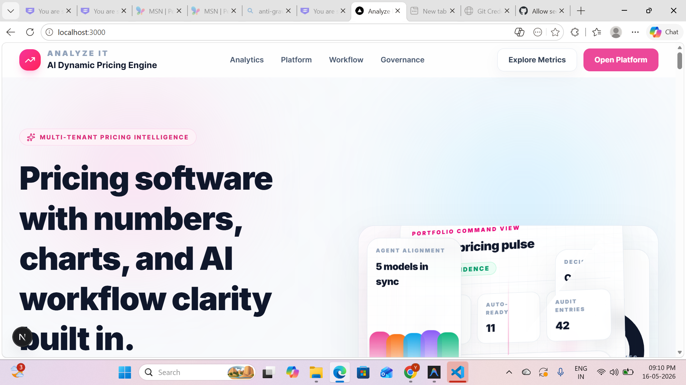
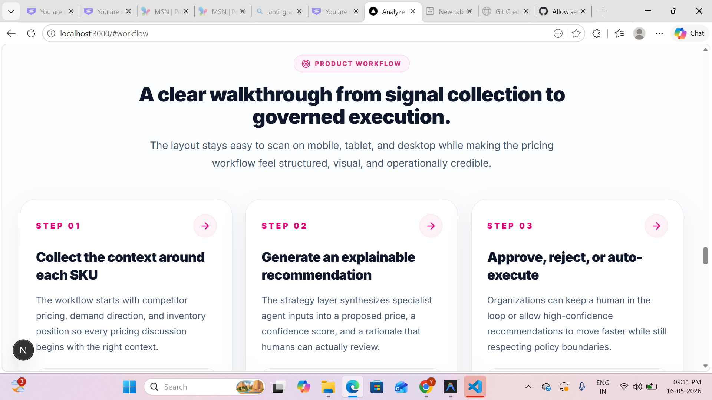
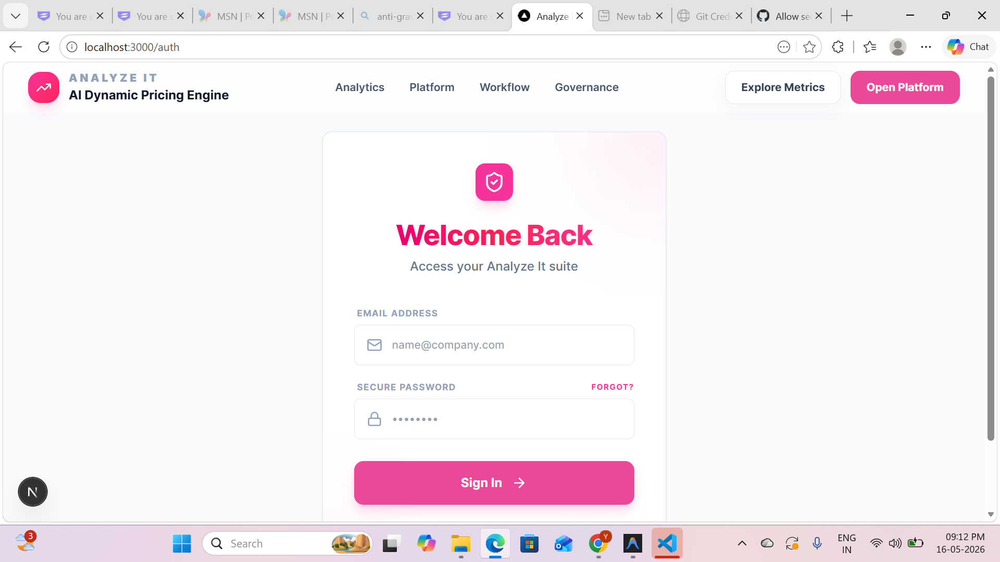
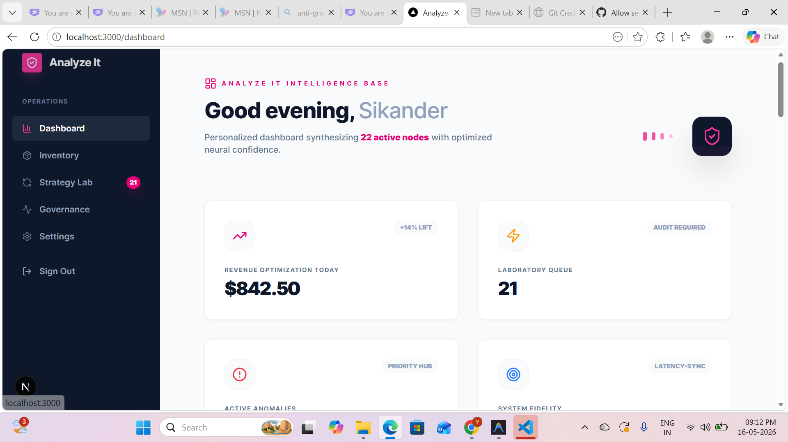
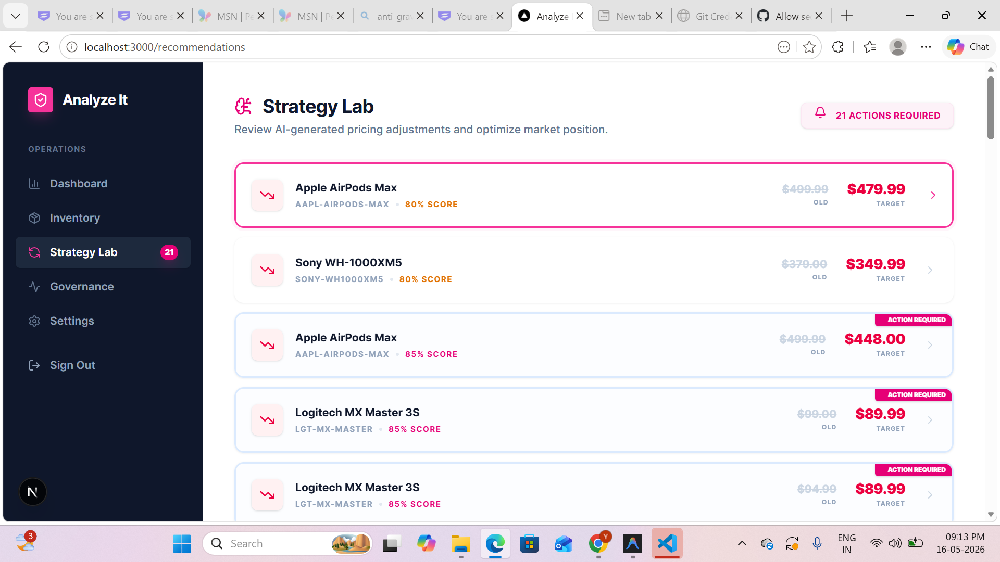
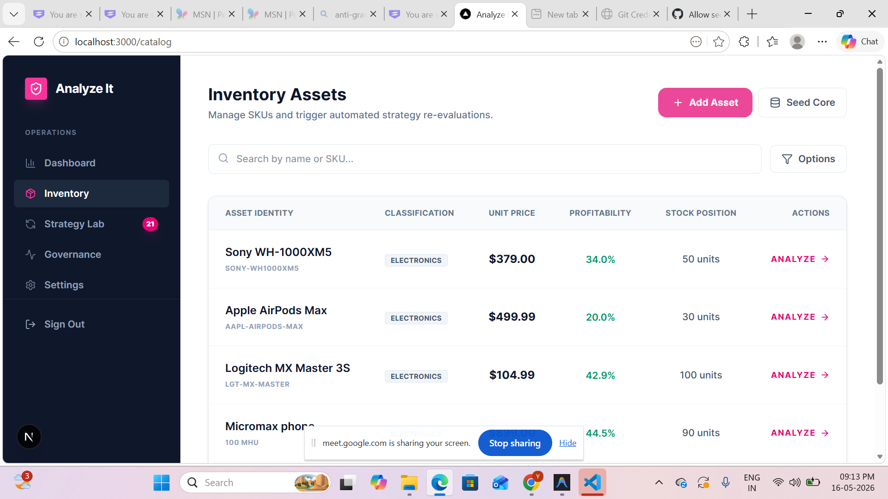

# AI-Powered Dynamic Pricing Backend

An intelligent, multi-agent pricing engine designed to analyze market trends, competitor data, and inventory levels to provide real-time, high-confidence pricing recommendations for e-commerce platforms.

## 🚀 The Chosen Solution: Multi-Agent Dynamic Pricing
I chose to implement a **Multi-Agent Orchestration Architecture** because pricing is a multi-dimensional problem. A single LLM prompt often fails to account for the nuances of inventory cost, demand elasticity, and aggressive competitor shifts. 

By splitting responsibilities into specialized agents (Market Intelligence, Demand, Inventory, and Strategy), the system achieves:
- **Higher Accuracy**: Each agent focuses on a specific data domain.
- **Better Explainability**: The "Rationale" provided to the user is a synthesis of expert outputs.
- **Scalability**: New data sources (like seasonal trends or shipping costs) can be added as new agents without refactoring the entire engine.

---

## 🛠️ Tech Stack & Rationale

| Technology | Role | Rationale |
| :--- | :--- | :--- |
| **Node.js & Express** | Runtime & API | Lightweight, asynchronous, and handles concurrent agent requests efficiently. |
| **MongoDB & Mongoose** | Database | Flexible schema for diverse product categories and unstructured AI audit logs. |
| **Groq (Llama 3.3)** | LLM Engine | Chosen for sub-second inference speeds (critical for real-time pricing) and high context window. |
| **JWT & Bcrypt** | Security | Robust multi-tenant authentication and password hashing. |
| **SendGrid** | Notifications | Industry-standard reliability for automated pricing alerts. |

---

## ⚙️ Setup Instructions

### Prerequisites
- Node.js (v18+)
- MongoDB Atlas account (or local MongoDB)
- Groq API Key
- Docker (Optional)

### Option 1: Docker (One-Command Setup)
The easiest way to run the entire stack (Frontend, Backend, and Database):
```bash
docker-compose up
```

### Option 2: Manual Installation

1. **Navigate to the server directory:**
   ```bash
   cd server
   npm install
   ```

2. **Environment Configuration:**
   Create a `.env` file in the `server` root (copy from `.env.example`):
   ```env
   PORT=5000
   MONGODB_URI=your_mongodb_connection_string
   JWT_SECRET=your_jwt_secret
   GROQ_API_KEY=your_groq_api_key
   SENDGRID_API_KEY=your_sendgrid_key
   ```

3. **Start the server:**
   ```bash
   npm start
   ```

---

## 📸 Application Preview (Screenshots)

> [!NOTE]
> Screenshots below represent the integrated frontend interacting with this backend.

1. **Landing Page**: Modern hero section highlighting AI-driven clarity.
   
2. **Product Workflow**: Step-by-step breakdown of signal collection to execution.
   
3. **Secure Authentication**: Multi-tenant login interface.
   
4. **Intelligence Dashboard**: Real-time revenue optimization and active node tracking.
   
5. **Strategy Lab**: AI-generated pricing recommendations with confidence scores.
   
6. **Inventory Assets**: Centralized SKU management and profitability analysis.
   

---

## 🌟 Bonus Features Implemented
- **Docker Compose**: One-command local setup for the whole project.
- **CI/CD Pipeline**: GitHub Actions for automated build checks.
- **Rate Limiting**: API protection using `express-rate-limit`.
- **Health Checks**: Observability endpoint at `/health`.
- **Export Feature**: Download recommendations as a CSV file.

---

## 🚧 Known Limitations & Future Roadmap
- **Mocked Scrapers**: Currently uses synthetic data for competitor prices.
- **Sequential Flow**: Agents currently run in sequence. Parallel execution is planned.
- **Human-in-the-loop**: High-risk price changes currently require manual approval.
